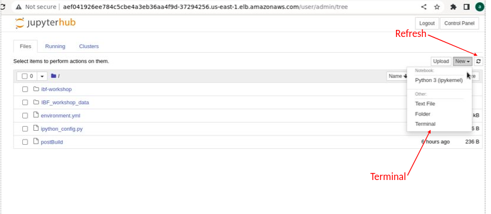

## The steps to access Jupyterhub

1. Get the link from repo https://github.com/icpac-igad/python-workshop/blob/main/README.md and visit in browser

2. Open a terminal in the interface, after entering your username and password


3. Clone your forked repository to the default location `/srv/repo/`
Use following commands

```
#ensure the location is /srv/repo
pwd
git clone https://github.com/lutta2022/python-workshop.git
```

4. After cloning in the terminal, get into the JupyterHub interface, (by clicking the JupyterHub logo), enter into the folder `python-workshop` and access the notebook in each folder


